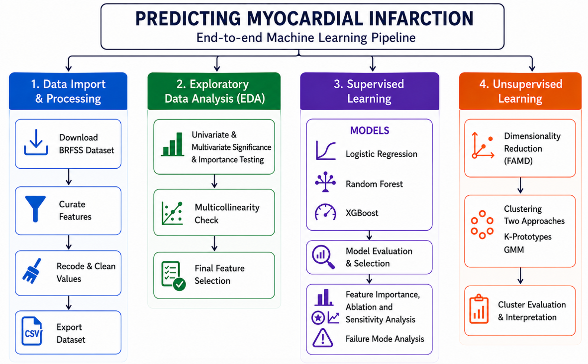

# Predicting Myocardial Infarction from BRFSS 2024
### SIADS 696 Milestone II · Maria Febus · Mubashar Khan · Alex Lee

Unsupervised clustering and supervised classification to identify and predict myocardial infarction / coronary heart disease using the CDC Behavioral Risk Factor Surveillance System.
Phase 2: Extending the team's predictive model into an agentic AI system where multiple specialized agents work together to interpret risk, retrieve clinical evidence, and support decisions. This phase, built independently, moves the project from prediction toward real-world clinical decision support.

## Methodology

The project follows an end-to-end machine learning pipeline covering data
processing, exploratory analysis, and both supervised and unsupervised
learning approaches:



## Data

**Source:** [BRFSS 2024 SAS Transport File](https://www.cdc.gov/brfss/annual_data/2024/files/LLCP2024XPT.zip) (~1 GB)

The raw data is not included in this repository. Run `notebook/1_import_process.ipynb` to download, extract selected columns, recode survey values, and save the processed CSV to `data/`.

## Notebooks

| # | Notebook | Description |
|---|----------|-------------|
| 1 | `1_import_process.ipynb` | Download BRFSS data, recode variables, export `processed_data.csv` |
| 2 | `2_eda_feature_selection.ipynb` | Exploratory data analysis and feature selection |
| 3 | `3_unsupervised_model.ipynb` | FAMD dimensionality reduction, K-Prototypes and GMM clustering |
| 4 | `4_supervised_model.ipynb` | Logistic Regression, Random Forest, XGBoost; SHAP, ablation, failure analysis |

## Report

pdf file for the final report is saved under the name SIADS_696_Report_Predicting_Myocardial_Infarction.pdf

## Setup

```
pip install -r requirements.txt
```

Run notebooks in order starting from `1_import_process.ipynb`.

## Acknowledgement

The authors utilized generative AI tools to assist in prototyping code. To maintain the integrity of this study, all AI-generated content underwent comprehensive human evaluation and verification. 

## Phase 2 - In progress

Extending the team's predictive model into an agentic AI system where multiple specialized agents work together to interpret risk, retrieve clinical evidence, and support decisions. This phase, built independently, moves the project from prediction toward real-world clinical decision support. As a first step, a prototype of the 'CardioAssist' desktop/web app is now available and can be accessed by clicking the link below.  

**CardioAssist** is a clinician-facing risk screening tool for care coordinators and clinicians to review a patient's predicted myocardial infarction risk (from the selected Random Forest model) alongside the factors driving that prediction, age, general health, diabetes status, etc., paired with a recommended next action (referral, tests, lifestyle counseling), not just a bare probability score.

Why desktop, not mobile: it's used in a clinical review workflow (queue of patients, side-by-side data + explanation panels, exportable reports), information-dense, multi-panel layouts that need screen real estate a phone can't give. This is standard for clinician-facing tools.

[View CardioAssist UX Prototype](CardioAssist.pdf)


